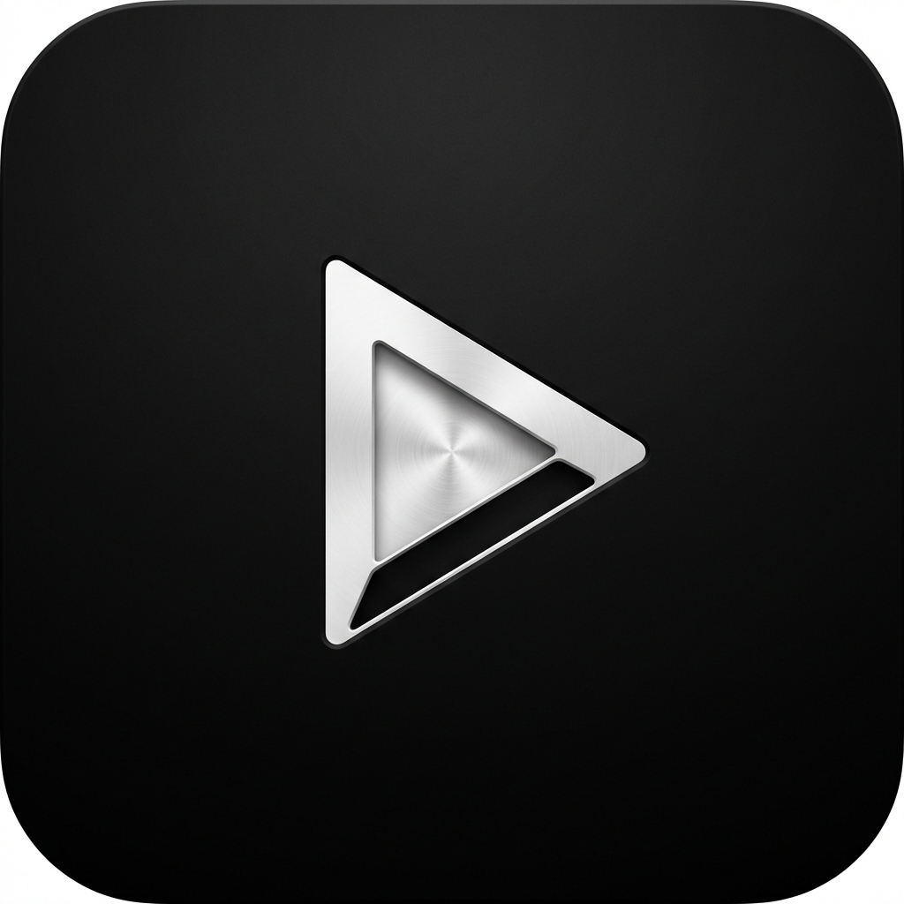

# AGI Player - Premium Local Video Player



**AGI Player** 是一款基于 Electron + React 构建的极简、高级感本地视频播放器。它专注于提供沉浸式的观影体验，通过毛玻璃视觉设计和全键盘快捷操作，重新定义本地播放器的审美与效率。

## ✨ 核心特性

- 🌑 **沉浸视觉**: 纯黑底色配合极简银色调，支持 Glassmorphism（毛玻璃）特效。
- ⌨️ **全键盘操控**: 
  - `Space`: 播放/暂停
  - `← / →`: 精确快退/快进 5s (带实时 Toast 提示)
  - `↑ / ↓`: 线性音量控制
  - `F`: 一键全屏
- 🖱️ **智能 UI**: 鼠标静止 3 秒自动隐藏控制栏，消除视觉干扰。
- 🚀 **桌面应用化**: 彻底脱离浏览器边框，提供纯净的可执行文件体验。
- 📦 **绿色分发**: 支持一键打包，生成 Windows 绿色版软件。

## 🛠️ 技术架构

- **前端**: React 19 + TypeScript + Vite
- **外壳**: Electron 40
- **图标库**: Lucide-React
- **构建**: Electron Builder

## 🚀 快速开始

### 开发测试
```bash
# 启动开发环境 (浏览器预览)
npm run dev

# 启动桌面模式
npm run electron:dev
```

### 生产打包
```bash
# 构建 Windows 安装包
npm run dist:win
```

## 📜 开源协议
本项目采用 MIT 协议，完全免费开放。

---
由 **AGI彼得潘** 倾力打造。
